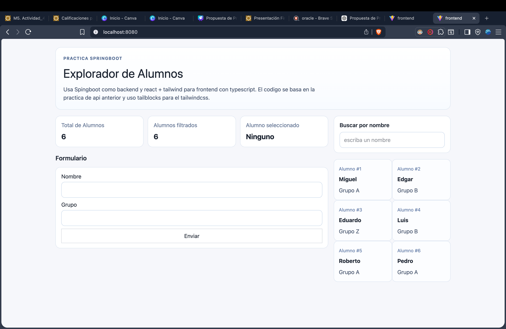

### Miguel Ángel Gavito González
### A00839096

Debes poder explicar:

1. Por que una imagen no es lo mismo que un contenedor.
  La imagen es la pura construccion de el contenedor por asi decirlo, con la imagen puedo crear el contenedor pero no tengo nada dentro o no corre asi aun. La imagen es una plantilla inmutable y el contenedor es la instancia de ejecucion de esa imagen.

2. Que se pierde al eliminar un contenedor sin volumen.
  La informacion no se mantiene si se elimina un contenedor sin volumen, en este caso seria el json.

3. Por que el JSON no debe guardarse dentro de recursos del `.jar`.
  El json es volumen y no debe ser parte del jar que se contruye, es como un programa de apuntes donde tiene apuntes del desarrollador metidos. El jar es inmutable, asi que no podrian ser persitentes con un volumen.

4. Que ventaja tiene una imagen final mas ligera.
  Ocupa menos espacio y es mas facil de utilizar en diferntes contextos.

5. Que hace el mapeo de puertos.
  Define que contenedores usan los puertos abierto y define que camino toma, es lo que hace el camino entre el puerto 8080 de mi maquina al puerto 8080 del contenedor.
  

